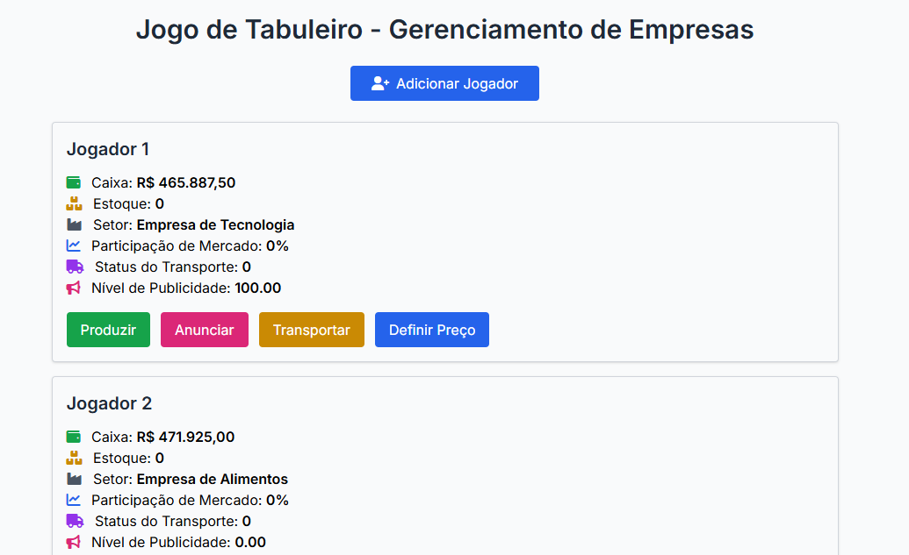

# 🏭 jogo-das-empresas

<p align="center">
  <strong>Simulação interativa para o ensino de gestão e matemática financeira</strong><br>
  Um jogo educacional que integra tomada de decisão empresarial, planejamento e pensamento lógico.
</p>

<div align="center">
  
   


  [▶️ Jogar Demo Online](https://vicfera001.github.io/jogo-empresas) | 
  [🐛 Reportar Bug](https://github.com/vicfera001/jogo-empresas/issues)
</div>

## 🎯 Sobre o Projeto
Jogo de estratégia empresarial onde os jogadores competem pelo domínio de mercados, gerenciando:
- Produção de mercadorias
- Investimentos em marketing
- Logística de transporte
- Eventos econômicos aleatórios

**Tecnologias**: HTML5, CSS3, JavaScript, Tailwind CSS

## 🚀 Como Executar
```bash
# Clone o repositório
git clone https://github.com/vicfera001/jogo-das-empresas.git

# Abra no navegador (não requer servidor)
open index.html
Ou acesse a demo online

🕹️ Mecânicas do Jogo
Recurso	Descrição
📊 Mercados	6 cidades com demandas variáveis
🏭 Produção	Crie produtos com diferentes specs
📢 Marketing	Invista em campanhas por região
🚚 Logística	Gerencie custos de transporte
💰 Eventos	5 eventos econômicos aleatórios

👥 Para Colaboradores
bash
# Fluxo recomendado:
1. Faça um fork
2. Crie uma branch (`git checkout -b feature/nova-mecanica`)
3. Commit (`git commit -m "Adiciona X"`)
4. Push (`git push origin feature/nova-mecanica`)
5. Abra um Pull Request
Áreas que precisam de ajuda:

Balanceamento econômico

Novos eventos aleatórios

Melhorias de UI/UX

📌 Regras de Contribuição
Documente novas funções com JSDoc

Mantenha consistência com o estilo atual

Teste as mudanças em index.html

📜 Licença
Distribuído sob licença MIT. Veja LICENSE para mais informações.

Desenvolvido com ❤️ por Victor (https://github.com/vicfera001) - 📧 vicfera75@gmail.com
